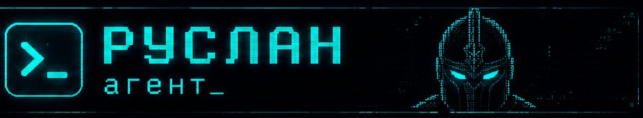

<p align="center">
  
</p>

# Ruslan Agent ☤
<p align="center">
  <a href="https://ruslan.team/">Ruslan Agent</a> | <a href="https://ruslan.team/">Ruslan Desktop</a>
</p>
<p align="center">
  <a href="https://ruslan.team/docs/"></a>
  <a href="https://ruslan.team/discord"></a>
  <a href="https://github.com/valldun1/ruslan/blob/main/LICENSE"></a>
  <a href="https://ruslan.team"></a>
  <a href="README.en.md"></a>
  <a href="README.zh-CN.md"></a>
  <a href="README.es.md"></a>
</p>

**Самообучающийся ИИ-агент, созданный [Valldun](https://valldun.dev).** Единственный агент со встроенным циклом обучения — он создаёт навыки из опыта, улучшает их в процессе использования, сохраняет знания между сессиями, ищет в собственных прошлых разговорах и строит углублённую модель того, кто вы есть. Работает на VPS за $5, GPU-кластере или serverless-инфраструктуре, которая почти ничего не стоит в простое. Не привязан к вашему ноутбуку — общайтесь с ним из Telegram, пока он работает на облачной VM.

Используйте любые модели — **российские модели** [**YandexGPT**](https://yandex.cloud/ru/services/yandexgpt) и [**GigaChat**](https://developers.sber.ru/gigachat) от Sber, а также [Nous Portal](https://portal.nousresearch.com), [OpenRouter](https://openrouter.ai) (200+ моделей), [NovitaAI](https://novita.ai), [NVIDIA NIM](https://build.nvidia.com) (Nemotron), [Xiaomi MiMo](https://platform.xiaomimimo.com), [z.ai/GLM](https://z.ai), [Kimi/Moonshot](https://platform.moonshot.ai), [MiniMax](https://www.minimax.io), [Hugging Face](https://huggingface.co), OpenAI или свой собственный endpoint. Переключение одной командой `ruslan model` — без правки кода и привязки к вендору.

<table>
<tr><td><b>Настоящий терминальный интерфейс</b></td><td>Полноценный TUI с мультистрочным редактированием, автодополнением слеш-команд, историей диалогов, прерыванием и перенаправлением, потоковым выводом инструментов.</td></tr>
<tr><td><b>Работает там, где вы</b></td><td>Telegram, Discord, Slack, WhatsApp, Signal, CLI — всё из одного gateway-процесса. Расшифровка голосовых сообщений, непрерывность диалога между платформами.</td></tr>
<tr><td><b>Замкнутый цикл обучения</b></td><td>Курируемая агентом память с периодическими напоминаниями. Автономное создание навыков после сложных задач. Навыки самоулучшаются в процессе использования. FTS5-поиск по сессиям с LLM-суммаризацией для межсессионного recall. <a href="https://github.com/plastic-labs/honcho">Honcho</a> диалектическое моделирование пользователя. Совместимость со стандартом <a href="https://agentskills.io">agentskills.io</a>.</td></tr>
<tr><td><b>Автоматизация по расписанию</b></td><td>Встроенный cron-планировщик с доставкой на любую платформу. Ежедневные отчёты, ночные бэкапы, еженедельные аудиты — на естественном языке, работают без присмотра.</td></tr>
<tr><td><b>Делегирование и параллелизм</b></td><td>Запуск изолированных сабагентов для параллельных задач. Написание Python-скриптов, вызывающих инструменты через RPC — превращение многошаговых пайплайнов в zero-context-cost витки.</td></tr>
<tr><td><b>Работает где угодно, не только на вашем ноутбуке</b></td><td>Шесть терминальных бэкендов: локальный, Docker, SSH, Singularity, Modal и Daytona. Daytona и Modal предлагают serverless-персистентность — окружение агента засыпает в простое и просыпается по запросу, почти ничего не сто́я между сессиями. Запускайте на VPS за $5 или GPU-кластере.</td></tr>
<tr><td><b>Готов к исследованиям</b></td><td>Пакетная генерация траекторий, сжатие траекторий для обучения следующего поколения моделей, работающих с инструментами.</td></tr>
</table>

---

## Быстрая установка

### Linux, macOS, WSL2, Termux

```bash
curl -fsSL https://ruslan.team/install.sh | bash
```

### Windows (нативный, PowerShell)

> **Важно:** Нативный Windows запускает Ruslan без WSL — CLI, gateway, TUI и инструменты работают нативно. Если предпочитаете WSL2, однострочник для Linux/macOS работает и там. Нашли баг? Пожалуйста, [сообщите](https://github.com/valldun1/ruslan/issues).

Запустите в PowerShell:

```powershell
iex (irm https://ruslan.team/install.ps1)
```

Установщик обрабатывает всё: uv, Python 3.11, Node.js, ripgrep, ffmpeg **и портативный Git Bash** (MinGit, распаковывается в `%LOCALAPPDATA%\ruslan\git` — не требует прав администратора, полностью изолирован от системного Git). Ruslan использует этот встроенный Git Bash для shell-команд.

Если Git уже установлен, установщик обнаруживает его и использует его. В противном случае достаточно ~45MB MinGit — он не затронет и не помешает системному Git.

> **Android / Termux:** Проверенный ручной путь описан в [руководстве по Termux](https://ruslan.team/docs/getting-started/termux). В Termux Ruslan устанавливает дополнительный `.[termux]`, так как полный `.[all]` тянет несовместимые с Android голосовые зависимости.
>
> **Windows:** Нативный Windows полностью поддерживается — однострочник PowerShell выше устанавливает всё. Если предпочитаете WSL2, команда Linux работает и там. Нативная установка Windows — `%LOCALAPPDATA%\ruslan`; WSL2 — `~/.ruslan`.

После установки:

```bash
source ~/.bashrc    # перезагрузите shell (или: source ~/.zshrc)
ruslan              # начинайте общение!
```

### Устранение проблем

#### Windows Defender или антивирус помечает `uv.exe` как вредоносное ПО

Если ваш антивирус (Bitdefender, Windows Defender и т.д.) помещает `uv.exe` из папки `bin` Ruslan (`%LOCALAPPDATA%\ruslan\bin\uv.exe`) в карантин, это **ложное срабатывание**. Файл — это Astral `uv` — Rust-менеджер пакетов Python, который Ruslan использует для управления Python-окружением. ML-антивирусы часто помечают неподписанные Rust-бинарники, скачивающие и устанавливающие пакеты.

**Проверка подлинности:**

```powershell
# Установите GitHub CLI при необходимости
winget install --id GitHub.cli

# Войдите в GitHub
gh auth login

# Запустите проверку
$uv = "$env:LOCALAPPDATA\ruslan\bin\uv.exe"
$ver = (& $uv --version).Split(' ')[1]
[Net.ServicePointManager]::SecurityProtocol = [Net.SecurityProtocolType]::Tls12
$zip = "$env:TEMP\uv.zip"
Invoke-WebRequest "https://github.com/astral-sh/uv/releases/download/$ver/uv-x86_64-pc-windows-msvc.zip" -OutFile $zip -UseBasicParsing
gh attestation verify $zip --repo astral-sh/uv
Expand-Archive $zip "$env:TEMP\uv_x" -Force
(Get-FileHash "$env:TEMP\uv_x\uv.exe").Hash -eq (Get-FileHash $uv).Hash
```

Если аттестация говорит "Verification succeeded" и последняя строка выводит `True`, всё в порядке.

**Чтобы добавить Ruslan в белый список:**
- **Windows Defender:** Запустите PowerShell от админа → `Add-MpPreference -ExclusionPath "$env:LOCALAPPDATA\ruslan\bin"`
- **Bitdefender:** Добавьте исключение в консоли Bitdefender (Protection > Antivirus > Settings > Manage Exceptions)
- Добавляйте в белый список **папку**, а не хеш файла — Ruslan обновляет `uv` и хеш меняется с каждой версией

Подробнее: [astral-sh/uv#13553](https://github.com/astral-sh/uv/issues/13553), [astral-sh/uv#15011](https://github.com/astral-sh/uv/issues/15011), [astral-sh/uv#10079](https://github.com/astral-sh/uv/issues/10079).

---

## Начало работы

```bash
ruslan              # Интерактивный CLI — начните разговор
ruslan model        # Выберите LLM-провайдера и модель
ruslan tools        # Настройте, какие инструменты включены
ruslan config set   # Установите отдельные значения конфига
ruslan gateway      # Запустите шлюз обмена сообщениями (Telegram, Discord и т.д.)
ruslan setup        # Запустите полный мастер настройки
ruslan claw migrate # Импорт из OpenClaw
ruslan update       # Обновление до последней версии
ruslan doctor       # Диагностика проблем
```

📖 **[Полная документация →](https://ruslan.team/docs/)**

---

## Пропустите сбор API-ключей — Nous Portal

Ruslan работает с любым провайдером — это не меняется. Но если вы не хотите собирать пять отдельных API-ключей для модели, веб-поиска, генерации изображений, TTS и облачного браузера, **[Nous Portal](https://portal.nousresearch.com)** покрывает всё одной подпиской:

- **300+ моделей** — выбирайте любую через `/model <name>`
- **Tool Gateway** — веб-поиск (Firecrawl), генерация изображений (FAL), текст-в-речь (OpenAI), облачный браузер (Browser Use) — всё через одну подписку. Без лишних аккаунтов.

Одна команда после чистой установки:

```bash
ruslan setup --portal
```

Это логинит вас через OAuth, устанавливает Nous как провайдера и включает Tool Gateway. Проверить статус можно командой `ruslan portal info`. Подробнее на [странице Tool Gateway](https://ruslan.team/docs/user-guide/features/tool-gateway).

Вы можете по-прежнему использовать свои ключи для каждого инструмента — gateway работает поканально, а не по принципу «всё или ничего».

---

## CLI vs Мессенджеры: краткая справка

У Ruslan два входа: запустите терминальный UI через `ruslan` или запустите gateway и общайтесь из Telegram, Discord, Slack, WhatsApp, Signal или Email. В обоих интерфейсах доступны общие слеш-команды.

| Действие                        | CLI                                          | Платформы общения                                                                  |
| ------------------------------- | --------------------------------------------- | ---------------------------------------------------------------------------------- |
| Начать общение                  | `ruslan`                                      | Запустите `ruslan gateway setup` + `ruslan gateway start`, затем напишите боту     |
| Начать новый разговор           | `/new` или `/reset`                            | `/new` или `/reset`                                                                |
| Сменить модель                  | `/model [provider:model]`                     | `/model [provider:model]`                                                          |
| Установить личность             | `/personality [name]`                         | `/personality [name]`                                                              |
| Повторить или отменить последний ход | `/retry`, `/undo`                         | `/retry`, `/undo`                                                                  |
| Сжать контекст / проверить использование | `/compress`, `/usage`, `/insights [--days N]` | `/compress`, `/usage`, `/insights [days]`                                          |
| Просмотр навыков                | `/skills` или `/<skill-name>`                  | `/<skill-name>`                                                                    |
| Прервать текущую работу         | `Ctrl+C` или отправьте новое сообщение         | `/stop` или отправьте новое сообщение                                              |
| Статус платформы                | `/platforms`                                  | `/status`, `/sethome`                                                              |

Полные списки команд: [CLI guide](https://ruslan.team/docs/user-guide/cli) и [Messaging Gateway guide](https://ruslan.team/docs/user-guide/messaging).

---

## Документация

Вся документация на **[ruslan.team/docs](https://ruslan.team/docs/)**:

| Раздел                                                                                             | Что покрывает                                                  |
| -------------------------------------------------------------------------------------------------- | -------------------------------------------------------------- |
| [Быстрый старт](https://ruslan.team/docs/getting-started/quickstart)                                | Установка → настройка → первый разговор за 2 минуты             |
| [CLI](https://ruslan.team/docs/user-guide/cli)                                                      | Команды, горячие клавиши, личности, сессии                      |
| [Конфигурация](https://ruslan.team/docs/user-guide/configuration)                                   | Файл конфига, провайдеры, модели, все опции                     |
| [Messaging Gateway](https://ruslan.team/docs/user-guide/messaging)                                  | Telegram, Discord, Slack, WhatsApp, Signal, Home Assistant      |
| [Безопасность](https://ruslan.team/docs/user-guide/security)                                        | Подтверждение команд, DM-связка, изоляция контейнеров            |
| [Инструменты](https://ruslan.team/docs/user-guide/features/tools)                                   | 40+ инструментов, система наборов, терминальные бэкенды         |
| [Навыки](https://ruslan.team/docs/user-guide/features/skills)                                       | Процедурная память, Skills Hub, создание навыков                 |
| [Память](https://ruslan.team/docs/user-guide/features/memory)                                       | Постоянная память, профили пользователя, лучшие практики         |
| [MCP](https://ruslan.team/docs/user-guide/features/mcp)                                             | Подключение любых MCP-серверов                                   |
| [Cron](https://ruslan.team/docs/user-guide/features/cron)                                           | Задачи по расписанию с доставкой на платформы                    |
| [Context Files](https://ruslan.team/docs/user-guide/features/context-files)                         | Контекст проекта для каждого разговора                           |
| [Архитектура](https://ruslan.team/docs/developer-guide/architecture)                                | Структура проекта, цикл агента, ключевые классы                  |
| [Участие](https://ruslan.team/docs/developer-guide/contributing)                                    | Настройка разработки, PR, кодстайл                               |
| [CLI Reference](https://ruslan.team/docs/reference/cli-commands)                                    | Все команды и флаги                                              |
| [Переменные окружения](https://ruslan.team/docs/reference/environment-variables)                    | Полный справочник env-переменных                                 |

---

## Миграция с OpenClaw

Если вы переходите с OpenClaw, Ruslan может автоматически импортировать ваши настройки, воспоминания, навыки и API-ключи.

**При первой настройке:** мастер установки (`ruslan setup`) автоматически обнаруживает `~/.openclaw` и предлагает миграцию до начала конфигурации.

**В любое время после установки:**

```bash
ruslan claw migrate              # Интерактивная миграция (полный пресет)
ruslan claw migrate --dry-run    # Предпросмотр миграции
ruslan claw migrate --preset user-data   # Миграция без секретов
ruslan claw migrate --overwrite  # Перезапись существующих конфликтов
```

Что импортируется:

- **SOUL.md** — файл личности
- **Воспоминания** — MEMORY.md и USER.md
- **Навыки** — пользовательские навыки → `~/.ruslan/skills/openclaw-imports/`
- **Список разрешённых команд** — паттерны подтверждения
- **Настройки мессенджеров** — конфиги платформ, разрешённые пользователи, рабочая директория
- **API-ключи** — разрешённые секреты (Telegram, OpenRouter, OpenAI, Anthropic, ElevenLabs)
- **TTS-активы** — аудиофайлы рабочего пространства
- **Инструкции рабочего пространства** — AGENTS.md (с `--workspace-target`)

Смотрите `ruslan claw migrate --help` для всех опций или используйте навык `openclaw-migration` для интерактивной миграции с предпросмотром.

---

## Участие в разработке

Мы приветствуем вклад! Смотрите [Руководство участника](https://ruslan.team/docs/developer-guide/contributing) для настройки разработки, кодстайла и PR-процесса.

Быстрый старт для контрибьюторов — используйте стандартный установщик, затем работайте из полного git-чекаута, который он создаёт в `$RUSLAN_HOME/ruslan-agent` (обычно `~/.ruslan/ruslan-agent`):

```bash
curl -fsSL https://ruslan.team/install.sh | bash
cd "${RUSLAN_HOME:-$HOME/.ruslan}/ruslan-agent"
uv pip install -e ".[all,dev]"
scripts/run_tests.sh
```

Ручной клон (для временных клонов/CI):

```bash
curl -LsSf https://astral.sh/uv/install.sh | sh
uv venv .venv --python 3.11
source .venv/bin/activate
uv pip install -e ".[all,dev]"
scripts/run_tests.sh
```

---

## Сообщество

- 💬 [Discord](https://ruslan.team/discord)
- 📚 [Skills Hub](https://agentskills.io)
- 🐛 [Issues](https://github.com/valldun1/ruslan/issues)
- 🔌 [computer-use-linux](https://github.com/avifenesh/computer-use-linux) — Linux desktop-control MCP сервер для Ruslan
- 🔌 [HermesClaw](https://github.com/AaronWong1999/hermesclaw) — WeChat-мост

---

## Лицензия

MIT — смотрите [LICENSE](LICENSE).

Создано [Valldun](https://valldun.dev). Форк [nousresearch/hermes-agent](https://github.com/nousresearch/hermes-agent). Обновления и поддержка: [ruslan.team](https://ruslan.team).
